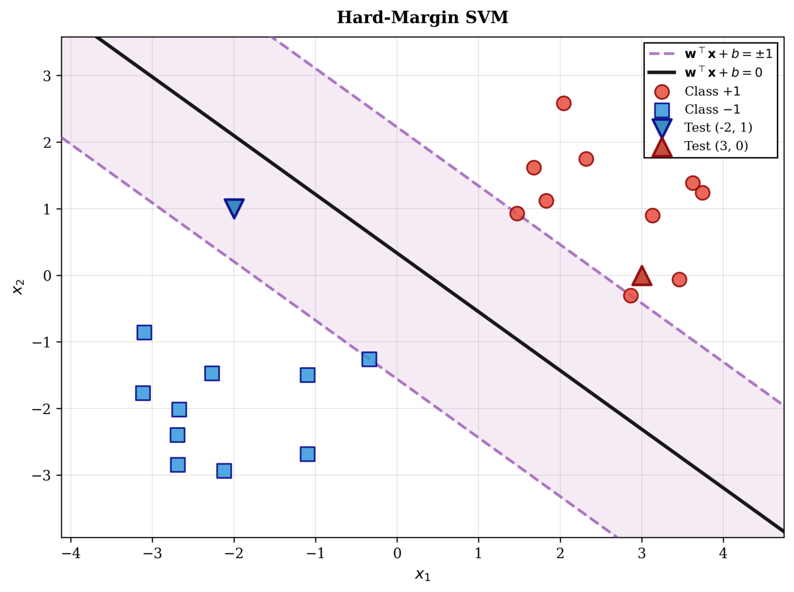
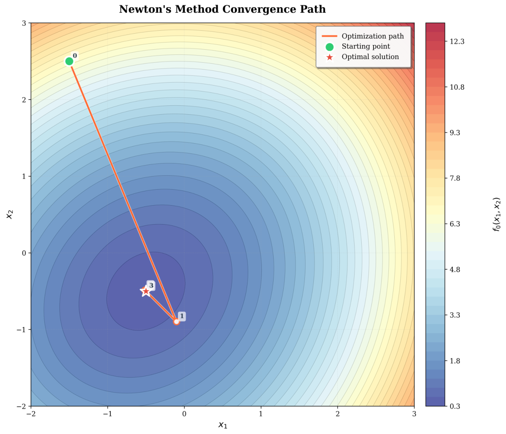
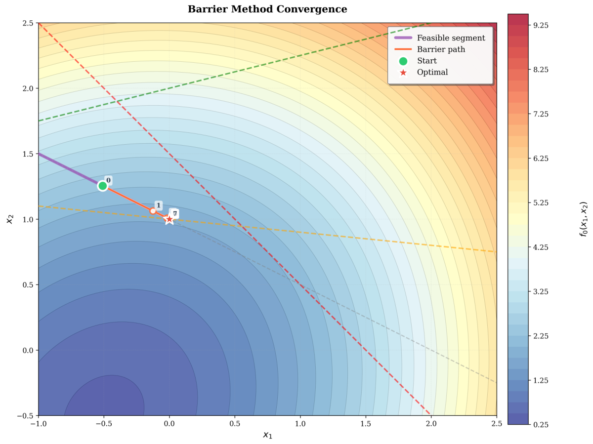
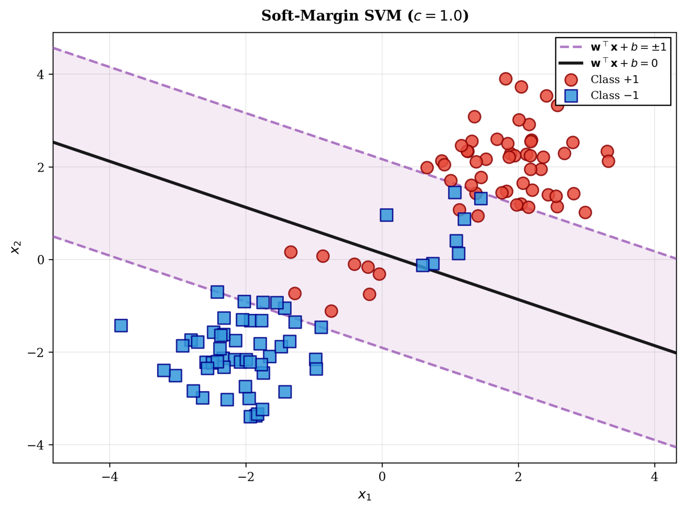

# Interior-Point Convex Solver and Max-Margin Classifiers

A Newton / log-barrier interior-point solver written from first principles in NumPy, then used to train hard- and soft-margin support vector machines with no off-the-shelf optimiser.

<p align="center">
  
</p>

## Overview

Interior-point methods sit underneath most production convex solvers, but they are usually used as black boxes. This project builds the full stack by hand: Newton's method with backtracking line search, an equality-constrained Newton solver based on the KKT system, a logarithmic barrier method, and a Phase I procedure to find a strictly feasible start. Only basic linear algebra (`np.linalg.solve`) is used. The same solver is then pointed at a machine-learning problem, training maximum-margin linear classifiers (SVMs) as convex quadratic programmes, which shows how the optimisation theory and the ML model fit together.

## Key results

- **Hard-margin SVM trained by the in-house barrier method:** converged in **9 outer iterations** to $w^\star = (0.466, 0.529)$, $b^\star = -0.176$, giving a geometric margin of **$r = 1/\lVert w^\star\rVert_2 = 1.42$**. The support vectors lie exactly on the margin: $\min_i y_i(w^{\star\top}x_i + b^\star) = 1$.
- **Constrained problem with Phase I:** Phase I returned a strictly feasible point with $s^\star = -0.348 < 0$. The barrier method then converged in **8 outer iterations** to $x^\star \approx (0, 1)$ with duality-gap estimate $m/t = 3.0\times10^{-7}$ and the active constraint at $f_3(x^\star) = -6.7\times10^{-8}$.
- **Newton's method:** reached the unique minimiser $x^\star = (-0.5, -0.5)$ in **3 iterations** from a distant start. Equality-constrained Newton converged in **1 iteration** from the minimum-norm feasible point.
- **Soft-margin SVM (116 points, 119 decision variables, 232 inequality constraints):** sweeping the penalty $c$ over four orders of magnitude traces the margin/violation trade-off:

| $c$ | Margin $r$ | Misclassified | Margin violations | Total slack $\sum_i \xi_i$ |
|---:|---:|---:|---:|---:|
| $10^{-2}$ | 2.36 | 16 | 44 | 25.4 |
| $10^{-1}$ | 1.93 | 16 | 26 | 23.8 |
| $1$ | 1.82 | 16 | 24 | 23.7 |
| $10$ | 1.71 | 15 | 24 | 23.7 |
| $10^{2}$ | 1.68 | 15 | 24 | 23.7 |

The margin shrinks monotonically as $c$ grows. Margin violations fall sharply between $c = 10^{-2}$ and $10^{-1}$ and change little beyond $c \approx 1$, so raising the penalty further gives diminishing returns.

<p align="center">
  
  
</p>

## Method

**Test objective.** $f_0(x) = \log(e^{x_1} + e^{x_2}) + \tfrac12\lVert x\rVert_2^2$. Its Hessian is $\operatorname{diag}(p) - pp^\top + I$ with $p = \operatorname{softmax}(x)$, which is positive definite everywhere. Gradients and Hessians are computed with a numerically stable softmax (`src/functions.py`).

**Newton with backtracking** (`src/optimizer.py`). Step $\Delta x = -\nabla^2 f(x)^{-1}\nabla f(x)$, Armijo backtracking with $\alpha = 0.1$ and $\beta = 0.5$, and termination when the Newton decrement satisfies $\lambda^2/2 \le 10^{-6}$.

**Equality-constrained Newton** (`newton_eq`). Each step solves the KKT system

$$
\begin{bmatrix} \nabla^2 f(x) & A^\top \\ A & 0 \end{bmatrix}
\begin{bmatrix} \Delta x \\ \nu \end{bmatrix}
= -\begin{bmatrix} \nabla f(x) \\ Ax - b \end{bmatrix},
$$

checks feasibility of the initial point, and projects back onto $\{Ax = b\}$ if numerical drift appears. The dual variable $\nu$ is returned so that KKT stationarity can be verified.

**Barrier method with Phase I** (`src/barrier.py`). The inner solves minimise $\phi_t(x) = t f_0(x) - \sum_i \log(-f_i(x))$ subject to $Ax = b$. The barrier parameter is increased geometrically ($t_0 = 1$, $\mu = 10$) until $m/t \le 10^{-6}$. A strictly feasible start comes from solving the Phase I problem $\min s$ s.t. $f_i(x) \le s$, $Ax = b$ with the same barrier machinery.

**SVMs** (`examples/svm_hard_margin.py`, `examples/svm_soft_margin.py`). The hard-margin primal $\min \tfrac12\lVert w\rVert_2^2$ s.t. $y_i(w^\top x_i + b) \ge 1$ and the $\ell_1$ soft-margin primal $\min \tfrac12\lVert w\rVert_2^2 + c\lVert\xi\rVert_1$ s.t. $y_i(w^\top x_i + b) \ge 1 - \xi_i$, $\xi \succeq 0$ are both written in barrier form $f_i \le 0$ and solved by the same interior-point loop.

**Analysis.** The study also derives the SVM dual and argues that strong duality holds via Slater's condition. It gives a rank condition, $\operatorname{rank}[G\ \ \mathbf 1] = n+1$, under which the Phase I Newton step is well defined, and identifies the dense $(n+p)\times(n+p)$ KKT solve as the $O(n^3)$ scalability bottleneck, with Schur-complement elimination and sparse iterative solvers as remedies.

**Verification.** The example scripts cross-check against SciPy reference solutions (`scipy.optimize.minimize`). They also verify KKT stationarity $\nabla f(x^\star) + A^\top\nu^\star = 0$ and check the feasibility of every constraint at the returned solution.

<p align="center">
  
</p>

## Repository structure

```
interior-point-solver/
├── src/
│   ├── functions.py   # f0, gradient and Hessian (stable log-sum-exp / softmax)
│   ├── optimizer.py   # backtracking line search, Newton, equality-constrained Newton (KKT)
│   ├── barrier.py     # log-barrier method + Phase I feasibility solver
│   └── plotting.py    # contour and iterate-path plots
└── examples/
    ├── newton.py              # unconstrained Newton
    ├── newton_equality.py     # equality-constrained Newton + KKT check
    ├── barrier_phase1.py      # barrier method + Phase I
    ├── svm_hard_margin.py     # hard-margin SVM via barrier method
    └── svm_soft_margin.py     # soft-margin SVM, sweep over c
```

## Reproducing

Run from the repository root. Figures are written to `plots/`.

```bash
uv run --with numpy --with scipy --with matplotlib python examples/newton.py
uv run --with numpy --with scipy --with matplotlib python examples/newton_equality.py
uv run --with numpy --with scipy --with matplotlib python examples/barrier_phase1.py
uv run --with numpy --with scipy --with pandas --with matplotlib python examples/svm_hard_margin.py   # needs data/svm_training_data.csv (not included)
uv run --with numpy --with scikit-learn --with matplotlib python examples/svm_soft_margin.py
```

`svm_hard_margin.py` expects the original training set (not redistributed) at `data/svm_training_data.csv` (columns `x_1, x_2, y`). Any 2-D labelled CSV in that format will run. `svm_soft_margin.py` generates its dataset deterministically (`make_blobs`, seed 42, plus 16 boundary points).

## Tech stack

Python · NumPy (all optimisation: linear solves only) · SciPy (reference cross-checks only) · pandas · scikit-learn (synthetic data) · Matplotlib

## Acknowledgements

Originally developed for 4M17 Practical Optimisation, Department of Engineering, University of Cambridge, under a no-off-the-shelf-solvers constraint. The unconstrained Newton routine builds on a provided baseline; the equality-constrained Newton solver, barrier method, Phase I and SVM formulations are my own.

## Licence

[MIT](LICENSE)
